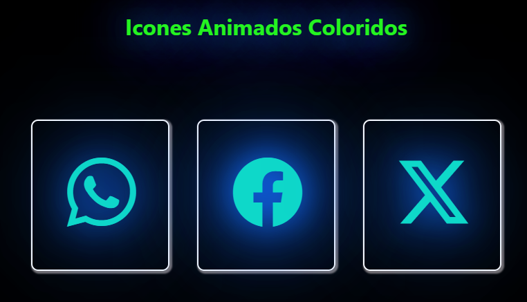

# 🌈 About the Project: Icones-Raiwbow

 

## The Icones-Raiwbow project is a simple and creative visual demonstration built with HTML and CSS, featuring three icons with a glowing neon effect.

## The main idea is to apply colorful, rainbow-style glow animations to the icons, creating a modern and eye-catching look. This project is non-functional — it serves purely as a visual showcase, ideal for studying CSS visual effects, especially shadows, transitions, and vibrant colors.

## It’s a great reference for anyone looking to explore creative styling and learn how to work with dynamic and colorful interface elements.

 

  

